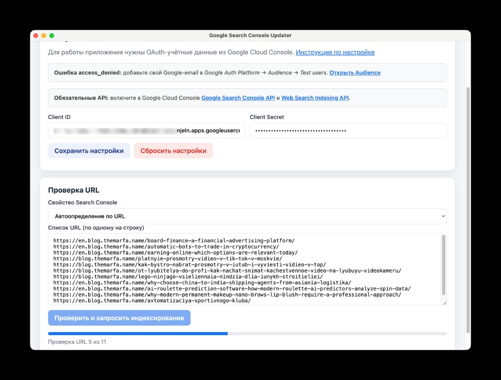

# Google Search Console Updater

> **Русский:** [README.md](README.md)

Portable app for **Windows** and **macOS** that inspects URLs via the [Google Search Console URL Inspection API](https://developers.google.com/webmaster-tools/v1/urlInspection.index/inspect) and requests indexing for pages that are not in the Google index.

**Source code:** [github.com/Marfa/Google_Search_Console_Index_Updater](https://github.com/Marfa/Google_Search_Console_Index_Updater)

**License:** [Creative Commons Attribution-NonCommercial-ShareAlike 4.0 International (CC BY-NC-SA 4.0)](https://creativecommons.org/licenses/by-nc-sa/4.0/)

> This project is distributed under the CC BY-NC-SA 4.0 license. Commercial use without separate permission is not allowed.

## Screenshot



## Features

- Sign in with a Google account that has Search Console access
- Inspect a list of URLs via the URL Inspection API
- Automatically request indexing for URLs that are not indexed
- Export results to CSV
- Russian / English UI
- Auto-updates from [GitHub Releases](https://github.com/Marfa/Google_Search_Console_Index_Updater/releases)

## Download

Portable builds are available in [Releases](https://github.com/Marfa/Google_Search_Console_Index_Updater/releases). See the release page for the current file names.

### Windows (x64)

1. Download `Google-Search-Console-Updater-<version>-win-x64.zip`
2. Unzip the archive
3. Run `Google Search Console Updater.exe` from the extracted folder

No installation required.

### macOS (Apple Silicon, arm64)

1. Download `Google-Search-Console-Updater-<version>-mac-arm64.zip`
2. Unzip the archive
3. Open `Google Search Console Updater.app`

For an unsigned app on first launch: **Right-click → Open → Open**.

#### Privacy & Security permissions

If Google sign-in does not complete or the browser does not open, go to **System Settings → Privacy & Security** and grant **Google Search Console Updater** the following permissions:

| Setting | Why it is needed |
|---------|------------------|
| **Local Network** | OAuth sign-in: the app receives Google's response on `127.0.0.1` |
| **Automation** | Opening the browser for Google sign-in (if macOS prompts for access) |

After granting permissions, restart the app and try **Sign in with Google** again.

## Google Cloud setup

Each user provides **their own** OAuth credentials. Secrets are not embedded in the app.

1. Open [Google Cloud Console](https://console.cloud.google.com/)
2. Create a project
3. Enable APIs:
   - [Google Search Console API](https://console.cloud.google.com/apis/library/searchconsole.googleapis.com)
   - [Web Search Indexing API](https://console.cloud.google.com/apis/library/indexing.googleapis.com)
4. Create an **OAuth client ID** of type **Desktop app**
5. Copy the **Client ID** and **Client Secret**
6. In **Google Auth Platform → Audience**, add your Google email to **Test users**

### Error 403: access_denied

While the OAuth app is in **Testing** mode, only emails listed in **Test users** can sign in:

1. [Google Auth Platform → Audience](https://console.cloud.google.com/auth/audience)
2. **Test users → Add users**
3. Add the email you use for Search Console

## How to use

1. Enter Client ID and Client Secret → **Save settings**
2. **Sign in with Google**
3. Paste your URL list (one per line)
4. Click **Inspect and request indexing**
5. Review results and export CSV if needed

**Reset settings** removes saved OAuth credentials and tokens from your device.

## Publishing the OAuth app for other users

### Option 1: Up to 100 users (no publishing)

Add each user's email in **Audience → Test users**. Good for small teams.

### Option 2: Public access (Publish app)

1. Fill in **Branding** (app name, support email)
2. Add scopes in **Data Access**
3. Click **Publish app** in **Audience**

The `webmasters` and `indexing` scopes are sensitive. Google will likely require **verification**:

- app website, privacy policy, terms of service;
- justification for each scope;
- OAuth flow demonstration;
- application in **Verification Center**.

Verification can take from several days to weeks.

### Option 3: Each user with their own OAuth (recommended)

Each user creates their own Google Cloud project, enters their Client ID / Secret in the app, and adds their email to Test users. No publishing required.

## Auto-update

The packaged app checks [GitHub Releases](https://github.com/Marfa/Google_Search_Console_Index_Updater/releases) on startup. When a new version is available, it downloads the `.zip` and shows an **Install and restart** button. You can also check manually from **About**.

> On unsigned macOS builds, auto-install may fail. Use **Download manually** in the update banner, or download the `.zip` from Releases and replace the `.app`. On Windows, download the new `.zip`, unzip it, and replace the app folder.

## Data storage

Credentials are **not stored in source code**. Locally on the user's device:

| Data | Path (Windows) | Path (macOS) |
|------|----------------|--------------|
| OAuth Client ID / Secret | `%APPDATA%\Google Search Console Updater\oauth-config.json` | `~/Library/Application Support/Google Search Console Updater/oauth-config.json` |
| Auth tokens | `%APPDATA%\Google Search Console Updater\tokens.json` | `~/Library/Application Support/Google Search Console Updater/tokens.json` |
| UI language | `%APPDATA%\Google Search Console Updater\settings.json` | `~/Library/Application Support/Google Search Console Updater/settings.json` |

## Build from source

```bash
npm install
npm start
npm run build:mac   # macOS (arm64)
npm run build:win   # Windows (x64)
```

Artifacts are written to `dist/`.

## API limits

| API | Limit |
|-----|-------|
| URL Inspection | ~600 requests/day per property |
| Indexing API | ~200 requests/day |

## Support

- [Source code](https://github.com/Marfa/Google_Search_Console_Index_Updater)
- [Donate](https://www.donationalerts.com/r/themarfa)
- [Crypto donation](https://nowpayments.io/donation/themarfa)

## Project structure

```
├── electron/       # Main process, OAuth, API, auto-update
├── renderer/       # UI, i18n
├── build/          # App icon
├── config.example.json
├── LICENSE
└── package.json
```

## About

This code was prepared with [Cursor](https://cursor.com/) — an AI-powered code editor.
