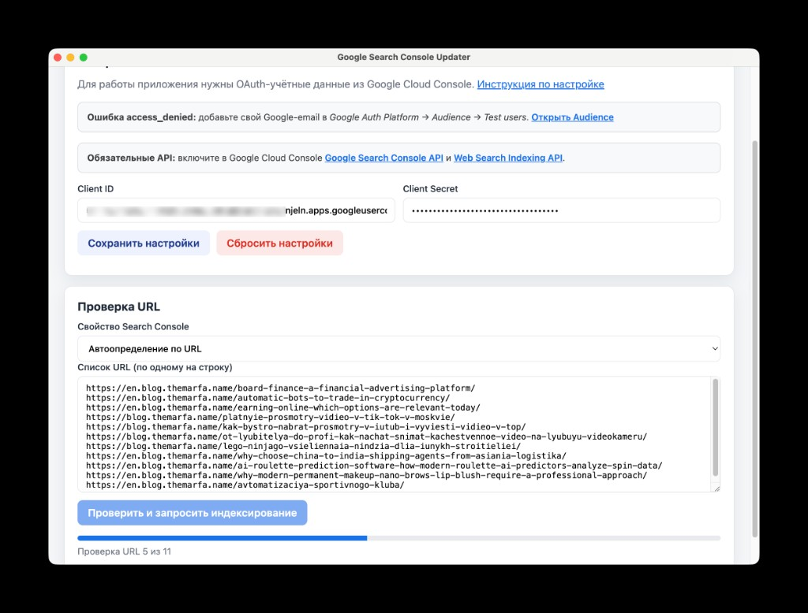

# Google Search Console Updater

> **Русский:** [README.md](README.md)

**URL indexing + Search Console SEO audit — with your own AI key.**

```bash
# macOS (Apple Silicon)
# download Google-Search-Console-Updater-2.0.0-mac-arm64.zip from Releases
xattr -cr "Google Search Console Updater.app"
open "Google Search Console Updater.app"
```

**Version:** 2.0.0 · **Source:** [github.com/Marfa/Google_Search_Console_Index_Updater](https://github.com/Marfa/Google_Search_Console_Index_Updater) · **License:** [CC BY-NC-SA 4.0](https://creativecommons.org/licenses/by-nc-sa/4.0/)

> Commercial use without separate permission is not allowed.

## Screenshot



## Features

| | |
|---|---|
| Indexing | URL Inspection + indexing requests for pages not in the index |
| Site audit | Search Analytics baseline (28/90 days), sitemaps, AI report |
| Your AI | OpenAI-compatible: OpenAI, Groq, xAI Grok, OpenRouter… |
| Import / export | `.txt` `.csv` `.xls` `.xlsx` → CSV; audit → Markdown |
| Language | RU / EN, including the OAuth callback |
| Updates | Checks [GitHub Releases](https://github.com/Marfa/Google_Search_Console_Index_Updater/releases) |

## Download

Portable builds: [Releases](https://github.com/Marfa/Google_Search_Console_Index_Updater/releases).

| Platform | File |
|----------|------|
| macOS arm64 | `Google-Search-Console-Updater-2.0.0-mac-arm64.zip` |
| Windows x64 | `Google-Search-Console-Updater-<version>-win-x64.zip` |

### Windows (x64)

1. Download zip → unzip  
2. Run `Google Search Console Updater.exe`  

No installer.

### macOS (Apple Silicon)

1. Download zip → unzip  
2. Open `Google Search Console Updater.app` (**Right-click → Open** on first launch)

### “App is damaged” (macOS)

```bash
xattr -cr "/path/to/Google Search Console Updater.app"
codesign --force --deep --sign - "/path/to/Google Search Console Updater.app"
```

From **v1.0.8**, packaging applies an ad-hoc signature (`after-sign.cjs`).

## Google Cloud setup

Secrets are not embedded — each user enters their own OAuth credentials.

1. [Google Cloud Console](https://console.cloud.google.com/) → project  
2. Enable [Search Console API](https://console.cloud.google.com/apis/library/searchconsole.googleapis.com) and [Indexing API](https://console.cloud.google.com/apis/library/indexing.googleapis.com)  
3. OAuth client ID type **Desktop app** → Client ID / Secret  
4. **Audience → Test users** — your Google email  

### 403: access_denied

In Testing mode, only emails listed under [Audience → Test users](https://console.cloud.google.com/auth/audience) can sign in.

## How to use

### Indexing

1. Client ID / Secret → **Save settings**  
2. **Sign in with Google**  
3. Paste URLs or **Import URLs from file**  
4. **Inspect and request indexing** → export CSV if needed  

### Site audit

1. **Site audit** tab → Search Console property  
2. AI base URL, model, API key → **Save AI settings**  
3. **Run audit** → baseline + rendered report → export Markdown  

The key is stored locally (`safeStorage`), same as OAuth.

#### AI provider examples

| Provider | AI base URL | Example model | Key |
|----------|-------------|---------------|-----|
| OpenAI | `https://api.openai.com/v1` | `gpt-4o-mini` | [platform.openai.com](https://platform.openai.com/) |
| Groq | `https://api.groq.com/openai/v1` | `llama-3.3-70b-versatile` | `gsk_…` key |
| xAI Grok | `https://api.x.ai/v1` | `grok-4.6` | [console.x.ai](https://console.x.ai/) (`xai-…`) |

> A env name like `GROK_API` does not mean xAI: a `gsk_…` key is Groq.

**Reset settings** removes OAuth credentials and tokens from the device.

## Publishing OAuth for others

| Option | When |
|--------|------|
| Test users (up to 100) | Team use, no publish |
| Publish app | Public access; sensitive scopes → Google verification |
| Each user with own OAuth | Recommended: own Cloud project, no publish |

## Auto-update

On launch the app checks [Releases](https://github.com/Marfa/Google_Search_Console_Index_Updater/releases). Without Apple signing on macOS, use **Download manually** more often.

## Data storage

| Data | Windows | macOS |
|------|---------|-------|
| OAuth Client ID / Secret | `%APPDATA%\Google Search Console Updater\oauth-config.json` | `~/Library/Application Support/Google Search Console Updater/oauth-config.json` |
| Tokens | `…\tokens.json` | `…/tokens.json` |
| AI API key | `…\ai-config.json` | `…/ai-config.json` |
| Locale / AI URL / model | `…\settings.json` | `…/settings.json` |

## Build

```bash
npm install
npm start
npm run build:mac   # → dist/Google-Search-Console-Updater-2.0.0-mac-arm64.zip
npm run build:win
npm run check:audit-helpers
```

## API limits

| API | Limit |
|-----|-------|
| URL Inspection | ~600 requests/day per property |
| Indexing API | ~200 requests/day |

## Support

- [Source code](https://github.com/Marfa/Google_Search_Console_Index_Updater)
- [Donate](https://www.donationalerts.com/r/themarfa)
- [Crypto donation](https://nowpayments.io/donation/themarfa)

## Structure

```
├── electron/       # OAuth, GSC API, AI client, audit, auto-update
├── renderer/       # UI, Indexing / Audit tabs, i18n
├── scripts/        # build hooks, check-audit-helpers
├── build/          # app icon
├── config.example.json
└── package.json
```

## About

This code was prepared with [Cursor](https://cursor.com/).

Support the project: [Donate](https://www.donationalerts.com/r/themarfa) · [Crypto donation](https://nowpayments.io/donation/themarfa)
